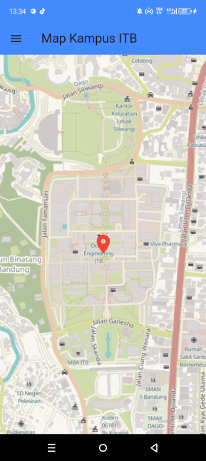
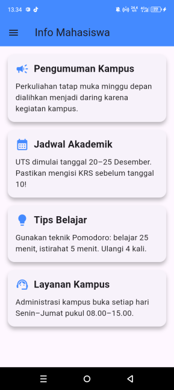

📱 Student Helper App

Aplikasi mobile berbasis Flutter yang membantu mahasiswa mengakses informasi penting kampus seperti lokasi kampus, daftar informasi akademik, menu navigasi, dan halaman profil aplikasi.

✨ Fitur Utama
🔹 1. Splash Screen

Tampilan awal aplikasi dengan animasi sederhana bertema Student Helper App.

🔹 2. Login

Form sederhana untuk proses masuk aplikasi.
Tidak menggunakan backend — hanya navigasi ke Home.

🔹 3. Register

Form pendaftaran dengan validasi dasar dan navigasi kembali ke halaman login.

🔹 4. Map (Lokasi Kampus)

Menggunakan library:

flutter_map

Menampilkan lokasi Institut Teknologi Bandung (ITB) di peta.

🔹 5. Halaman Informasi

List informasi berbentuk ListView yang berisi beberapa info akademik/kemahasiswaan.

🔹 6. Sidebar Navigation (Drawer)

Navigasi utama:

Home

Map

Info

About

Logout

🔹 7. About App

Berisi informasi aplikasi dan copyright:

Copyright © Daniel – NPM *******55

🧩 Library yang Digunakan
📌 flutter_map

Untuk menampilkan peta OpenStreetMap dan menandai lokasi kampus UTB.

Install melalui:

dependencies:
  flutter_map: ^7.0.2
  latlong2: ^0.9.0

📂 Struktur Folder Project
lib/
 ├── main.dart
 ├── screens/
 │    ├── splash_screen.dart
 │    ├── login_screen.dart
 │    ├── register_screen.dart
 │    ├── home_screen.dart
 │    ├── map_screen.dart
 │    ├── info_screen.dart
 │    ├── about_screen.dart
 ├── utils/
 │    └── app_routes.dart
 └── widgets/

🖼️ Screenshots
📌 Splash & Login
Splash	Login
	
📌 Register & Menu
Register	Menu
	
📌 Map & Info
Map	Info
	
📌 About

▶️ Cara Menjalankan Project

Clone repository:

git clone https://github.com/NAMA-USER/uts_pemmob2_daniel.git

Masuk ke folder project:

cd uts_pemmob2_daniel

Install dependencies:

flutter pub get

Jalankan aplikasi:

flutter run
